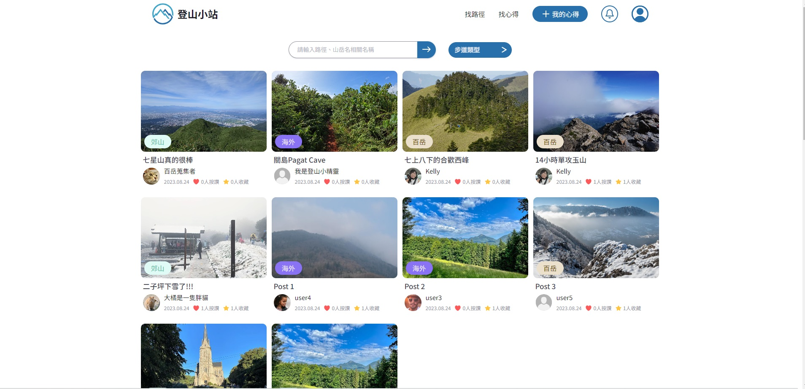
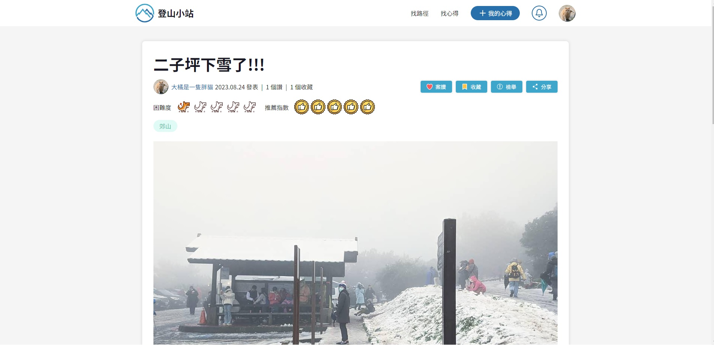
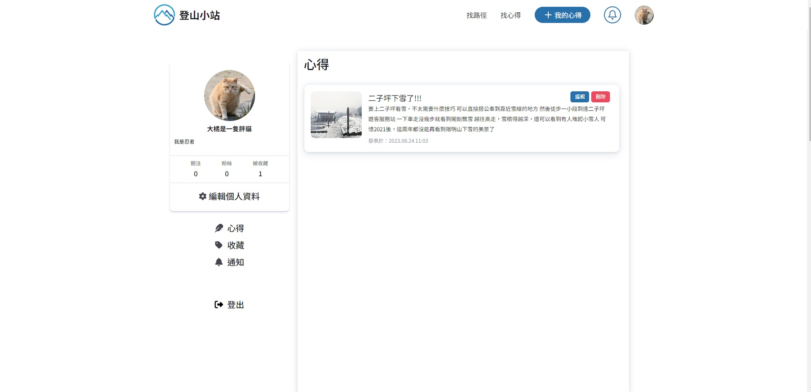
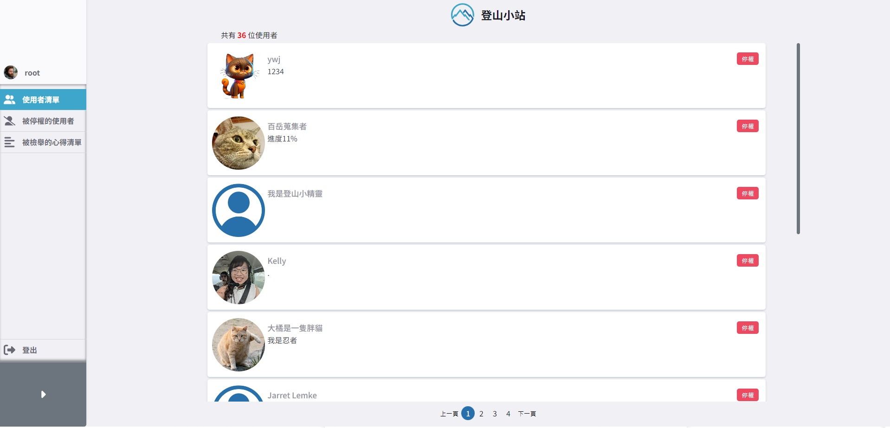

# 登山小站

登山小站是一個登山資訊平台，使用者可以瀏覽、查找登山路線及心得，並下載相關的GPX檔案。<br>
[gh-page 連結](https://magic9701.github.io/into-mountain/) <br>
[後端 repo 連結](https://github.com/jiasyuanchu/Trail-Finder) <br>

## 畫面截圖







## 功能說明

### 前台功能

登入、註冊、修改個人資料 <br>
撰寫心得文章、瀏覽/案讚/收藏/檢舉/分享 心得 <br>
瀏覽/收藏/分享路線、回報路況、查看GPX軌跡、下載GPX檔案 <br>
搜尋心得或路徑 <br>
使用者頁面可查看 收藏內容/發布內容/追蹤者/追隨者/通知(當文章被檢舉刪除時)，並可刪除自己發的心得文 <br>

### 後台功能

登入、瀏覽所有使用者、審核檢舉、刪除文章、停權/恢復使用者
請使用預設管理員帳號登入
帳號: root
密碼: 1234

## 使用說明

1. 確認有安裝 node.js、npm
2. clone 專案
3. 使用終端機進入專案資料夾，輸入:

```
 $ npm install
```

4. 啟動專案

```
 $ npm start
```

## 使用工具

    "axios": "^1.4.0",
    "clsx": "^2.0.0",
    "gh-pages": "^6.0.0",
    "leaflet": "^1.9.4",
    "react": "^18.2.0",
    "react-dom": "^18.2.0",
    "react-dropzone": "^14.2.3",
    "react-leaflet": "^4.2.1",
    "react-loading-skeleton": "^3.3.1",
    "react-router-dom": "^6.14.2",
    "react-scripts": "5.0.1",
    "sweetalert2": "^11.7.20",
    "web-vitals": "^2.1.4"
    "sass": "^1.63.6"

## Contributors

### 前端

- Ya-Yun(Kelly) [https://github.com/magic9701](https://github.com/magic9701)
- Willy [https://github.com/ywcheng1207](https://github.com/ywcheng1207)

### 後端

- Kevin_L [https://github.com/av124773](https://github.com/av124773)
- Chia-Hsuan Chu [https://github.com/jiasyuanchu](https://github.com/jiasyuanchu)
